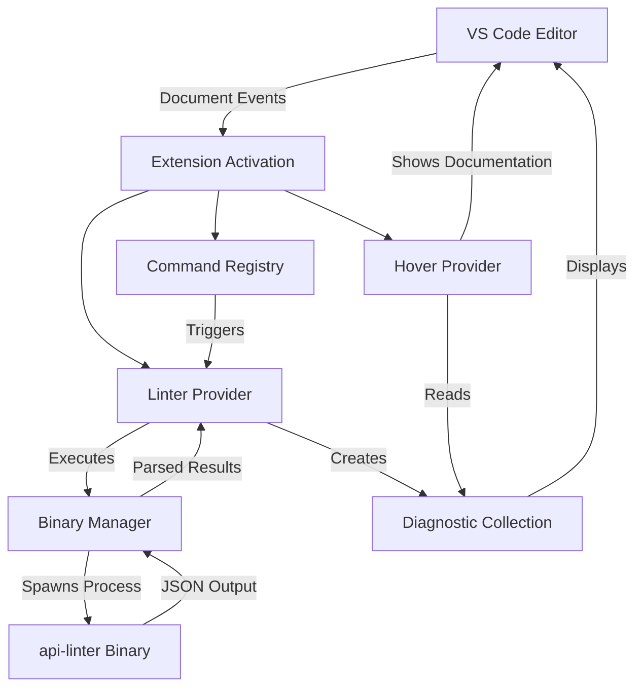
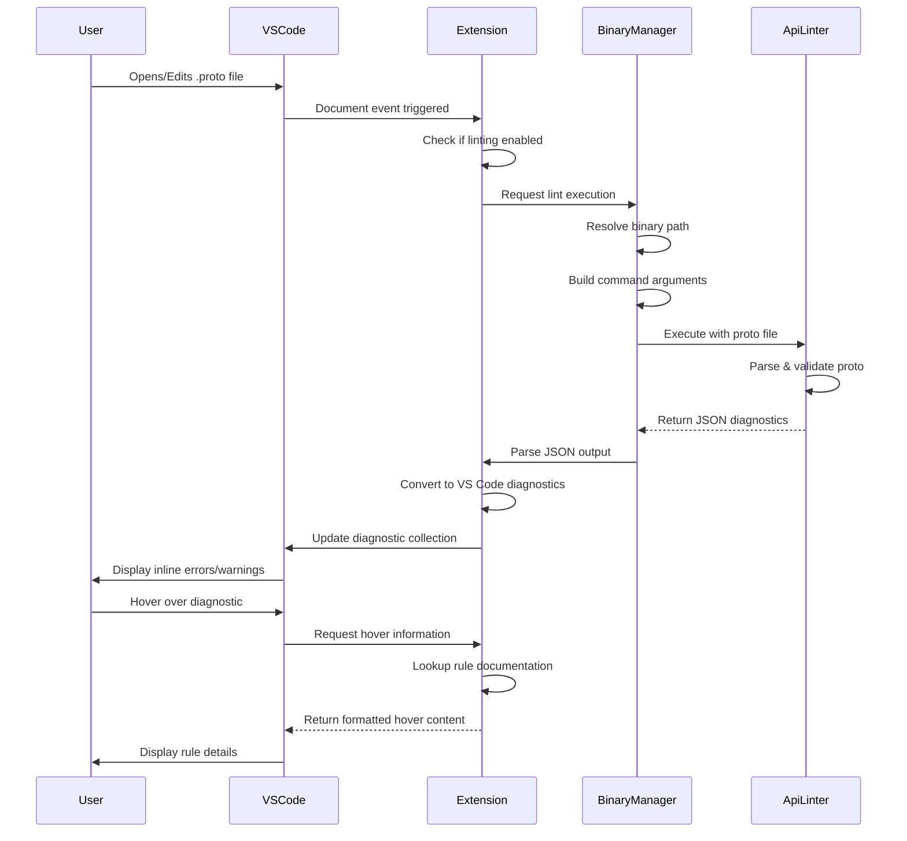

# Google API Linter for VS Code

A Visual Studio Code extension that integrates the [Google API Linter](https://github.com/googleapis/api-linter) to validate Protocol Buffer files against the [Google API Design Guidelines](https://cloud.google.com/apis/design). This extension provides real-time linting, diagnostics, and inline documentation for API design rules.

## Features

- **Real-time Linting**: Automatically validates `.proto` files as you type or save
- **Syntax Highlighting**: Full Protocol Buffers syntax highlighting with TextMate grammar
- **Inline Diagnostics**: Displays linting errors and warnings directly in the editor
- **Hover Documentation**: Shows detailed rule information when hovering over diagnostics
- **Automatic Binary Management**: Downloads and updates api-linter binary automatically
- **Automatic googleapis Integration**: Downloads googleapis protos on first use - no configuration needed
- **Smart Proto Path Detection**: Automatically detects workspace root and `.gapi/googleapis` directories
- **Workspace Linting**: Lint all proto files in your workspace with a single command
- **Update Notifications**: Prompts when new api-linter versions are available
- **Configurable Rules**: Enable or disable specific linting rules via configuration
- **Cross-Platform**: Works on Windows, macOS, and Linux

## Architecture

The extension operates through a multi-layered architecture that integrates the `api-linter` binary with VS Code's diagnostic system.



## How It Works

### Workflow Overview



### Component Breakdown

#### 1. Extension Activation
When a `.proto` file is opened or the extension starts:
- Registers diagnostic collection for displaying linting results
- Creates output channel for logging
- Initializes linter and hover providers
- Registers commands and document event listeners

#### 2. Binary Manager
Manages the `api-linter` binary and googleapis:
- Automatically downloads api-linter binary to `~/.gapi/` on first use
- Automatically downloads googleapis from GitHub
- Checks for updates every 10 days and prompts user
- Constructs command-line arguments from configuration
- Handles process spawning and output streaming
- Parses JSON output into structured diagnostics

#### 3. Linter Provider
Core linting logic:
- Receives document change events
- Invokes binary manager with current file
- Transforms linter output to VS Code diagnostics
- Updates diagnostic collection with results

#### 4. Hover Provider
Provides contextual information:
- Detects when user hovers over a diagnostic
- Retrieves rule documentation from diagnostic metadata
- Formats and displays rule details in hover tooltip

## Installation

### Prerequisites

**None!** The extension automatically downloads and manages the `api-linter` binary and googleapis protos for you.

### Extension Installation

1. **From VS Code Marketplace**
   - Open VS Code
   - Go to Extensions (Cmd+Shift+X / Ctrl+Shift+X)
   - Search for "Google API Linter"
   - Click Install

2. **From VSIX File**
   ```bash
   code --install-extension google-api-linter-1.0.0.vsix
   ```

## Configuration

Configure the extension through VS Code settings (File > Preferences > Settings or `Cmd+,`):

### Available Settings

| Setting | Type | Default | Description |
|---------|------|---------|-------------|
| `gapi.binaryPath` | string | `"api-linter"` | Path to the api-linter binary |
| `gapi.enableOnSave` | boolean | `true` | Run linter when saving proto files |
| `gapi.enableOnType` | boolean | `false` | Run linter while typing (may impact performance) |
| `gapi.configPath` | string | `""` | Path to `.api-linter.yaml` configuration file |
| `gapi.protoPath` | array | `[]` | Additional proto import paths |
| `gapi.disableRules` | array | `[]` | Rules to disable (e.g., `["core::0192::has-comments"]`) |
| `gapi.enableRules` | array | `[]` | Rules to explicitly enable |
| `gapi.descriptorSetIn` | array | `[]` | FileDescriptorSet files for imports |
| `gapi.ignoreCommentDisables` | boolean | `false` | Ignore disable comments in proto files |
| `gapi.setExitStatus` | boolean | `false` | Return exit status 1 on lint errors |

### Example Configuration

```json
{
  "gapi.binaryPath": "/usr/local/bin/api-linter",
  "gapi.enableOnSave": true,
  "gapi.enableOnType": false,
  "gapi.protoPath": [
    "${workspaceFolder}/proto",
    "${workspaceFolder}/third_party/googleapis"
  ],
  "gapi.disableRules": [
    "core::0192::has-comments"
  ]
}
```

### Workspace Configuration

For project-specific settings, create `.vscode/settings.json`:

```json
{
  "gapi.configPath": "${workspaceFolder}/.api-linter.yaml",
  "gapi.protoPath": [
    "${workspaceFolder}/proto",
    "${workspaceFolder}/third_party"
  ]
}
```

## Usage

### Commands

Access commands via Command Palette (Cmd+Shift+P / Ctrl+Shift+P):

- **Google API Linter: Lint Current File** - Lint the currently open proto file
- **Google API Linter: Lint All Proto Files in Workspace** - Lint all `.proto` files in workspace
- **Google API Linter: Create Config File** - Generate a `.api-linter.yaml` template
- **Google API Linter: Update googleapis Commit** - Download specific googleapis commit to workspace `.gapi/`
- **Google API Linter: Restart** - Restart the linter (useful after config changes)

### Automatic Linting

By default, the extension lints proto files:
- When opening a proto file
- When saving a proto file (if `gapi.enableOnSave` is true)
- When typing (if `gapi.enableOnType` is true, with 1-second debounce and auto-save)

### Viewing Diagnostics

Linting results appear:
- **Inline**: Squiggly underlines in the editor
- **Problems Panel**: View > Problems (Cmd+Shift+M / Ctrl+Shift+M)
- **Hover**: Hover over underlined code to see rule details

## API Linter Configuration

Create a `.api-linter.yaml` file in your project root to configure linting rules:

```yaml
# Disable specific rules
disabled_rules:
  - core::0192::has-comments
  - core::0203::optional

# Enable specific rules
enabled_rules:
  - core::0140::prepositions

# Rule-specific configuration
rule_configs:
  core::0192::
    allow_missing_comments: true
```

Refer to the [api-linter documentation](https://linter.aip.dev/) for available rules and configuration options.

## Troubleshooting

### Binary Not Found

**Error**: `api-linter binary not found`

**Solution**:
The extension automatically downloads the binary on first use. If you see this error:
1. Check your internet connection
2. Ensure `~/.gapi/` directory is writable
3. Alternatively, set `gapi.binaryPath` to a custom binary location

### Import Errors

**Error**: `Import "google/api/annotations.proto" was not found`

**Solution**:
The extension automatically downloads googleapis on first use. If imports still fail:
1. Check that `~/.gapi/googleapis/` exists and contains proto files
2. For workspace-specific googleapis version, run: **Google API Linter: Update googleapis Commit**
3. Manually add proto paths if needed:
   ```json
   {
     "gapi.protoPath": ["${workspaceFolder}/.gapi/googleapis"]
   }
   ```

### Performance Issues

If linting is slow or causes lag:
1. Disable `gapi.enableOnType` (keep `gapi.enableOnSave` enabled)
2. The extension uses 1-second debouncing for on-type linting to minimize performance impact
3. Use `.api-linter.yaml` to disable expensive rules
4. Exclude large proto files or directories

## Development

### Building from Source

```bash
# Clone repository
git clone https://github.com/machanirobotics/google-api-linter-vscode.git
cd google-api-linter-vscode

# Install dependencies
npm install

# Compile TypeScript
npm run compile

# Package extension
npm run package

# Install locally
code --install-extension google-api-linter-1.0.0.vsix
```

### Project Structure

```
vscode-googleapi-linter/
├── src/
│   ├── extension.ts          # Extension entry point
│   ├── linterProvider.ts     # Core linting logic
│   ├── binaryManager.ts      # Binary execution handler
│   ├── hoverProvider.ts      # Hover documentation
│   ├── commands.ts           # Command implementations
│   ├── constants.ts          # Shared constants
│   ├── types.ts              # TypeScript type definitions
│   └── utils/                # Utility functions
├── package.json              # Extension manifest
├── tsconfig.json             # TypeScript configuration
└── .github/
    └── workflows/
        └── release.yaml      # CI/CD pipeline
```

## Contributing

Contributions are welcome! Please follow these guidelines:

1. Fork the repository
2. Create a feature branch: `git checkout -b feature/your-feature`
3. Make your changes with clear commit messages
4. Add tests if applicable
5. Submit a pull request

## License

This project is licensed under the Apache License 2.0. See [LICENSE.md](LICENSE.md) for details.

## Resources

- [Google API Linter](https://github.com/googleapis/api-linter)
- [Google API Design Guide](https://cloud.google.com/apis/design)
- [API Improvement Proposals (AIPs)](https://google.aip.dev/)
- [Protocol Buffers](https://protobuf.dev/)

## Support

- **Issues**: [GitHub Issues](https://github.com/machanirobotics/google-api-linter-vscode/issues)
- **Discussions**: [GitHub Discussions](https://github.com/machanirobotics/google-api-linter-vscode/discussions)

---

**Machani Robotics** | [GitHub](https://github.com/machanirobotics) | [Website](https://machanirobotics.com)
